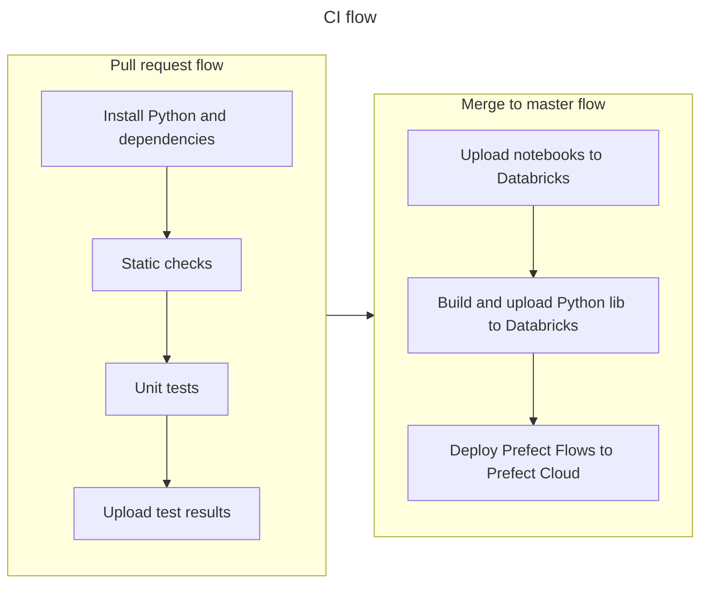

Training project to make Databricks pipelines.

CI _(GitHub Actions)_ will run checks, tests and deploy the notebooks to the Databricks server and Prefect Flows to a Prefect Cloud.

> [!NOTE]
> This project is still in WIP

---
### Pre-requirements

Following things will be needed:
- [Azure](https://portal.azure.com/) account (For _'Azure Databricks'_ and _'Azure Blob Storage'_)

### Setup environment

1) Setup Azure Databricks and create token for your account.
2) Create container `flows` in Azure Storage.
3) Prepare `.env` file from an [`.env_template`](.env_template): `cp .env_template .env` and fill your secrets.

### CI flow
GitHub Actions CI/CD flow defined under [`.github/workflows`](.github/workflows):

