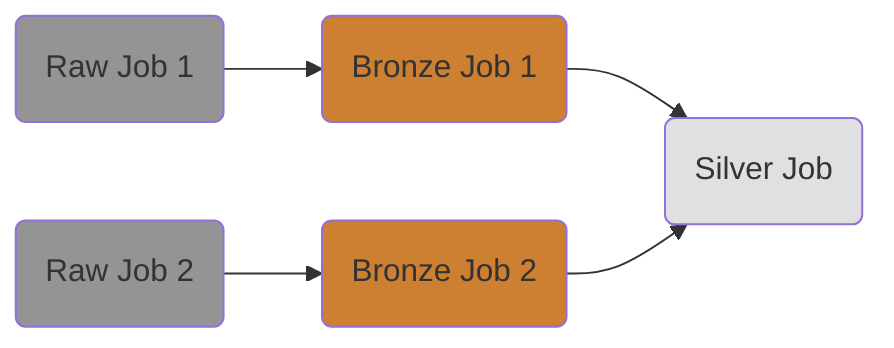

Training project to make Databricks pipelines.

CI _(GitHub Actions)_ will run checks, tests and deploy notebooks and jobs to the Databricks server.

> [!NOTE]
> This project is still in WIP

### Databricks Jobs
Here are approximate Databricks Jobs dependencies:

---

### Setup environment

1) Setup Azure Databricks and create token for your account.
2) Prepare `.env` file from an [`.env_template`](.env_template): `cp .env_template .env` and fill your secrets.

### CI flow
GitHub Actions CI/CD flow defined under [`.github/workflows`](.github/workflows):

